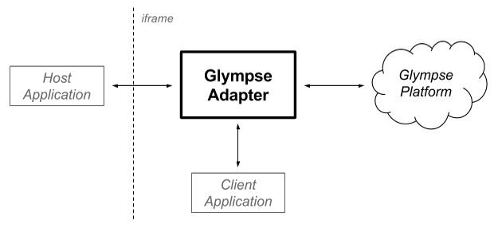
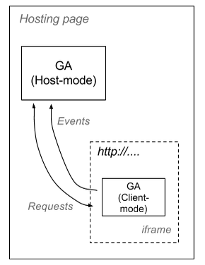
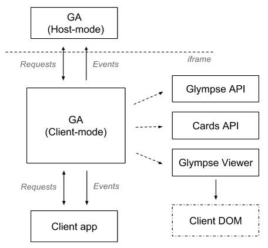
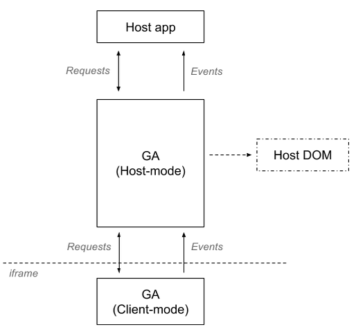

# The Glympse Adapter

## Overview

The Glympse Adapter (GA) is a portable component that allows Javascript-based
applications to interface with the Glympse platform. This interface can be made
directly with client applications wishing to utilize additional components like the
Glympse viewer, or indirectly via an iframe interface in a pure data-only format.

The basic structure of the GA in action can be seen below:



The GA automates many of the tasks involved with instantiating the Glympse viewer,
interfacing with the Glympse Platform API (from generating user accounts to requesting
data for a particular Glympse/Cards-based invite code), the Glympse Viewer API (adding/
removing invites, changing map settings, adjusting UI layouts, etc.), to invoking an
iframe-based view of a remote GA-enabled application, as shown below:



In addition, the API bridge provided by the GA maintains a mostly equivalent adaption
of the Glympse viewer API, save for some differences in event handler registration and
callback signatures. These (and all, really) will be described in detail. By default,
the exposed set of endpoints are those of the core Glympse Viewer API. Apps can also
extend/override the GA endpoints with their own methods, which are published to GA
consumers during setup.


## Client-Mode
Below descibes how to utilize the GA in "client-mode", where full access is available
to all Viewer components, data structures, and many customization options. However, it
also requires more care in getting going, and maintaining a clean separation from the
Glympse Viewer, which will now be partially affected by the global namespace and
default styling options.

### Usage

The architecture of the GA running in client-mode is shown below:



GA usage is straight-forward, but does have a dependency on a recent version of
[jQuery]. jQuery aside, all that is needed is to include the built
`GlympseAdapter` in your page, along with a bit of initialization and configuration
to get the adapter up and running:

```html
<script type="text/javascript" src="glympse-adapter-CURRENT_VERSION.min.js"></script>
```

Alternatively, the GA is available as a [Bower] package to include with your project
if using [RequireJS] via `bower install glympse-adapter --save`. If using the Bower
package, there is no need to include it as an external reference.

Initialization, including inserting the viewer into your page, should be done after
the page onLoad event has fired:

```javascript
$(window).ready(function()
{
	...
	... other init code
	...

	// Set up the adapter

	/* Global namespace */
	var adapter = new glympse.GlympseAdapter(adapter_handler_instance, cfg);

	/* AMD module format */
	//var GlympseAdapter = require('glympse-adapter/GlympseAdapter');
	//var adapter = new GlympseAdapter(adapter_handler_instance, cfg);

	adapter.client($('#div_viewer_container'));   // Note jQuery object reference
});
```

A couple of things to note here:
- `adapter_handler_instance` is a class instance to handle events and messages
  generated by the GA (described below).
- `cfg` is a simple Javascript object that defined both adapter and Glympse Viewer
  configuration (described below).
- `div_viewer_container` is the id of an HTML `div` element that already exists in
  the local DOM. The Glympse viewer will be inserted into this element when it is
  fully loaded.

For the `viewer_handler_reference` class, it must provide a public method with a
signature of `notify(idMessage, messageData)`. The `idMessage` parameter is a string
that will be one of the values as defined in the `glympse.GlympseAdapterDefines.MSG`
object. `messageData` can be a number of different types, depending on the value of
`idMessage`. Please refer to the *Adapter Messages/Events* section for specifics of
each message type.

GA client-mode  configuration format has two main components -- one for the Glympse
Viewer, and one for the adapater itself:

```javascript
var cfg =
{
	viewer: {
		.. normal viewer config settings ..
	}
	, adapter: {
		  card: *string*
		, t: *string*
		, pg: *string*
		, g: *string*
		, twt: *string*
		, hideEvents: *bool*
		, hideUpdates: *bool*
		, initialize: *function*
		, interfaces: { id0: callback0, ..., idN: callbackN }
		, apiKey: *string*|null|undefined
		, sandbox: *bool*
		, svcGlympse: *string*
		, svcCards: *string*
		, dbg: *bool*
		, loaderEnvironment: *string*
        , loaderPath: *string*
        , loaderVersion: *string*
	}
};
```

- `viewer` configuration is the normal Glympse viewer configuration object, described
  elsewhere. It should be noted that a valid invite/group/Twitter handler/Twitter
  topic setting should be set for normal viewer initialization.
- `adapter` settings are as follows:
  - `hideEvents`: Don't send event-related messages back to the
  `viewer_handler_reference.notify()` method. Currently, this includes everything
  except the `StateUpdate` message.
  - `hideUpdates`: Don't send `StateUpdate` messages back to the
  `viewer_handler_reference.notify()` method.
  - `initialize`: Method to call when the adapter has successully synced with a host
  adapater via iframe interface. Can be null.
  - `interfaces`: Allows for local overrides/extensions of advertised Glympse viewer
  endpoints. More details can be found in *Custom Endpoints*. Can also be null,
  - `apiKey`: Specifies the Core API key to use. If not set, the adapter will run in
  anonymous mode, which will allow only for the viewing of Core API invites.
  - `sandbox`: Force usage of the sandbox environment for Cards/Glympses
  - `svcGlympse`: Override the default Glympse API datacenter. Default is
  `//api.glympse.com/v2/`.
  - `svcCards`: Override the default Cards API datacenter. Default is
  `//api.cards.glympse.com/api/v1/`.
  - `dbg`: Enable debugging state. Defaults to `false`.
  - `card`, `t`, `g`, `twt`, `pg`: Standard Cards/Glympse invite types.
  - `loaderEnvironment`: Environment for the viewer's loader: "prod" (glympse.com) | "sandbox" (dev.glympse.com). Default is "prod".
  - `loaderVersion`: Version of the viewer's loader. Default is "latest".
  - `loaderPath`: Arbitrary URL to the loader (overrides `loaderEnvironment` and `loaderVersion`). Default is NULL.


### Custom Marker Configuration
For the `addMarkers(cfgMarkers)` API, the `cfgMarkers` object is of the following
format:

	cfgMarkers = { showInfo: true|false, markers: [ marker_0_cfg, marker_1_cfg, ..., marker_N_cfg ] };

Each marker configuration is of the following format:

```javascript
var marker_N_cfg = { //ext: { path: image_url, id: null, w: width, h: height  }	// do not use if using icon setting
				 icon: { id: icon_id_from_spritesheet } // for internal
				, lat: latitude
				, lng: longitude
				, info: text_to_display // use \n to force a line break
				, track: true|false     // include for map-centering
				, link: url_to_load_if_marker_clicked
				, style: {
					  fontFamily: available_font_family
					, color: CSS_color
					, fontSize: font_size
					, maxWidth: max_width_in_pixels (forcing word wrap)
					, background: null|CSS_color
					, textMargin: margin_in_pixels
					}
				};
```

### Custom Route Options
For the `addRoute(cfgRoute)` API, the following configuration object is used:

```javascript
var cfgRoute = { start: [ lat, lng ]
			   , end: [ lat, lng ]
			   , useNubs: true|false // Add nubs to the start/end points
			   , nubSize: 6          // Nub radius
			   , nubStroke: 0.1      // Nub stroke
			   , style: { strokeColor: 'rgba(255,0,0,0.8)' }
		   };
```

### Custom Endpoints
While not usuaully necessary, the GA allows for extending and/or overriding the
default set of endpoints exposed by the Adapter if you need to allow for additional
functionality. As noted above, the format for specifying custom endpoints is in the
adapter's `interfaces` configuration setting:

```javascript
var cfg =
{
	viewer: {
		.. normal viewer config settings ..
	}
	, adapter: {
		.. other adapter settings ..
		, interfaces: { id0: callback0, ..., idN: callbackN }
	}
};
```

The `interfaces` object is an optional collection of methods to be made available for
GA consumers, or to override existing Glympse viewer methods. Each item in the
collection is decribed in the following manner:

- `id`: The name of the interface to advertise to GA host-mode consumers upon initial
adapter setup.
- `callback`: The method to execute when called from the GA host-mode consumer.

For `id`, if the name is the same as one of the pre-defined endpoints (listed above),
the default implementation is replaced with this custom version. However, the default
is still available via the id with the same name, but with a `base_` prefix (i.e.
`base_getValue` to reach the Glympse viewer's implementation).

Almost any valid Javascript name can be used, save for the default public method names
of the GA. To be safe, prefix the name of your custom endpoints with a unique name
(i.e. "my" would work wonderfully).

For now, your customized endpoints should return some value directly, if expected by
the caller. The current version of the GA does not support deferred responses. In the
next version, a Promise-based return value will allow for async handling for delayed
results (i.e. Ajax-based calls).

And for reference, the test app pair of `index-test.html` and `test/app.js` show an
example custom endpoint of `customMethodExample`. This can be easily extended and/or
enhanced for your needs.

### Examples
An example of setting up a GA client-mode-based application can be found in
`app/src/test-client/index-client.html`. This test app demonstrates various GA actions
when a Glympse or Card invite is loaded.

This example should be used as a reference of how to invoke and interact with the GA
in client-mode.


## Host-Mode
Below descibes how to utilize the GA in "host-mode", with limited access to Viewer
components and data structures. It runs in an iframe-based environment, providing a
clean separation to the rest of the page in which it is embedded. That said, the
communication channel established with the View-Mode-based GA control is fairly robust
and can handle a number of data types (including such things as image data).

### Usage

The architecture of the GA running in host-mode is shown below:



Host-Mode usage has been designed to replicate the Glympse Viewer and Cards APIs,
adding a bit of initialization and configuration to get the adapter up and running.
All that is needed is to include the built GlympseAdapter.js in your page:

```html
<script type="text/javascript" src="glympse-adapter-VERSION.min.js"></script>
```

As noted in the Client Mode section, the GA can also be used in an AMD module
environment via Bower. Same set-up semantics apply when using GA in host mode.

Initialization, including inserting the viewer into your page, should be done after
the page onLoad event has fired:

```javascript
$(window).ready(function()
{
	...
	... other init code
	...

	// Set up the adapter

	/* Global namespace */
	var adapter = new glympse.GlympseAdapter(adapter_handler_instance, cfg);

	/* AMD module format */
	//var GlympseAdapter = require('glympse-adapter/GlympseAdapter');
	//var adapter = new GlympseAdapter(adapter_handler_instance, cfg);

	var el = adapter.host({
		url: 'http://glympse.com/INVITE_CODE',
		initialize: clientInitialized,
		connect: clientConnected,
		events:
		{
			StateUpdate: stateUpdate,
			ViewerInit: viewerInit,
			ViewerReady: viewerReady
		}
	});

	$('#divSandbox').append(el);

	...
});
```

A couple of things to note here:
- `adapter_handler_instance` is a class instance to handle events and messages
  generated by the GA (described below).
- `cfg` is a simple Javascript object that defined both adapter and Glympse Viewer
  configuration (described below).
- The iframed viewer is created/returned, when calling the GA instance's `host()`
  method.

`host()` configuration options are as follows:

- `url`: The Glympse invite URL. Generally this is the same as what is shared when
  sending a normal Glympse.
  - `partnerid`: Your app's registered PartnerId given to you by your
  Glympse representative
- `initialize`: Callback to handle iframe loaded event. Note that the Glympse viewer is
  not yet ready at this point, only that the page has been successfully loaded.
- `connect`: Callback to handle when the loaded Glympse viewer has registered itself
  with your hosting adapter. It is still not ready for action.
- `events`: Additional events to be handled by the host app. Not all events need to
  be handled if they aren't going to be used. Format is
  `{ event_id0: callback_handler0, ..., event_idN: callback_handlerN`. See the
  Host Events section below for available events that can be handled.

All API calls to the client-mode adapter return a Promise, allowing for async handling
of all results. These should be treated like any baseline [Promise/A+] system:

```javascript
adapter.map.getInviteProperty({ idProperty: GlympseAdapterDefines.STATE.Name }).then(function(data)
{
	console.log('Glympse invite sender's name: ' + data);
}
```

A more detailed description of all of the available Glympse viewer APIs is described
elsewhere in this document. Additionally, refer to `app/test-host/index-host.html` as
a reference for using all available APIs with the GA running in host-mode.


### Host Event support
Events generated by the hosted client-based GA application can be hooked during host
mode initialization. All of the named events can be mapped by providing a function
callback. If no callback is provided, no event will be generated.

#### Host-specific Events
A couple low-level events have been added to monitor the loading and initialization
steps during the course of loading an iframe'd Glympse Adapter-based viewer. Both
of these settings are specified in the passed `host(cfg)` API configuration (outlined
elsewhere). However, these events are generally not needed for most applications,
except to monitor initialization and loading progress.

- `Initialize`: Invoked whenever the iframe html has been loaded and registered with
  the host container. Callback format is: `callback(name)`. The passed `name`
  parameter in the callback is the id used interface with the client-hosted viewer.

- `Connect`: Sent once the hosted GA application has loaded and initialized
  its interfaces with the host container. Callback format is: `callback(options)`.
  The passed `options` parameter in the callback shows the features of the hosted
  iframe'd client:
  - `invitesCard`: *(string)* List of Card invites to load
  - `invitesGlympse`: *(string)* List of Glympse invites to load (*string*)
  - `id`: *(string)* Connected client app identifier (generally "glympse-adapter")
  (*string*)
  - `version`: *(string)* Connected client GA version (*string*)
  - `map`: *(array)* Available map-based APIs
  - `cards`: *(array)* Available cards-based APIs
  - `ext`: *(array)* Available custom APIs


#### Cards/Map/Custom Events
All of the GA-based event handlers are specified in the `events` section of the
`host(cfg)` configuration (as outlined above). The names of the handlers are identical
to the name of the Adapter event to be handled. For example, to handle the `ViewerInit`
and `ViewerReady` events, the `host()` config object would look like:

```javascript
var htmlElement = adapter.host(
	{ url: ...,
	  events: { ViewerInit: myViewerInit, ViewerReady: myViewerReady }
	}
);
```
If you do not specify a handler for a particular GA event, it will not be raised by GA.


### Examples
An example of setting up a GA host-mode-based application can be found in
`app/src/test-host/index-host.html`. This test app demonstrates how to hook into a
remote GA client-mode-based application and hook interesting events that are generated
when a Glympse or Card invite is loaded. There are also examples of how to directly
query the client-mode application to retreive data.

However, some setup is required to alias the local machine to point to the
`app/src/test-client/index-client.html` application. To use the example out of the box
(on an OSX-based system):

- Open a shell in the synced root directory of this repo
- Type: `cd app`
- Type: `python -m SimpleHTTPServer 8000`
- In a bowser, connect to: `app/src/test-host/index-host.html`

If the above isn't feasible for you, make whatever settings necessary to point to the
`app/src/test-client` directory to another port/domain and edit the `app.urlClient`
setting in `app/src/test-host/index-host.html` (on or around line 42).

This example should be used as a reference of how to invoke and interact with the GA
in host-mode.


## Adapter Messages/Events

The following is a description of the various notification messages (or Events, if
using GA in host-mode) that are sent by the adapter (defined in the
`GlympseAdapterDefines.MSG` object):

- `AccountCreateStatus` / `{ status: bool }`: Indicates the account has been created or
  creation failed with `error` message and `status: false`
- `AccountInit` / `{ status: bool }`: `status: true` - Indicates the adapter successfully
  logged in. `status: false` - Error occurred, property `error` has additional info about it
- `AdapterInit` / `{ isCard: bool, t: string }`: Indicates the adapter is beginning
  its loading sequence with the passed card invite or the specified Glympse invite
  (indicated via the `t` parameter)
- `AdapterReady` / `{ cards:[ invites ], glympses: [ invites ]}`: Specifies the
  adapter has resolved all Card and Glympse invites and will begin the process
  of loading the specified Glympse invites. It should be noted that the adapter
  may return a card that was not specified in the `AdapterInit` phase, and may
  have changed the initial Glympse invite code, or included additional Glympse
  invites. This is due to the adapter detecting a Card invite reference in the
  initial Glympse invite code, and aligning the viewer to the Card reference and
  it's child Glympse invites.
- `CreateRequestStatus` / `{ status: bool }`: Indicates the request was created or 
  creation failed with `error` message and `status: false`
- `CardInit` / `card_invite`: Fired just before an attempt is made to load the
  Card invite.
- `CardReady` / `card_invite`: Fired once the given Card invite has completed
  loading, regardless of success. Check the passed card's instance given upon
  the `CardsInitEnd` event.
- `CardsInitEnd` / `[ card_instance0, ..., card_instanceN ]`: Sent once all
  cards have been loaded. The passed array are a set of Card.js class instances
  that can be check for various properties/state. Please reference the `Card.js`
  Data Model section for available APIs.
  - Note that in GA Host mode, Card instances are not passed
- `CardsInitStart` / `[ card_invite0, ..., card_inviteN ]`: Notification sent
  just before Card data is loaded. The passed array is a list of the Card invite
  codes that will be loaded.
- `CardAdded` / `card`: Notification sent when new card is added and loaded.
- `CardRemoved` / `card`: Notification sent when card is removed.
- `CardUpdated` / `card`: Notification sent when card is updated (e.g. members' list changed).
- `CardsJoinRequestStatus`: Indicates that Card join request has been created or
  creation failed with `response.error` message and `status: false`
- `CardsJoinRequestCancelStatus`: Indicates that Card join request has been cancelled or
  cancelling failed with `response.error` message and `status: false`
- `CardRemoveMemberStatus`: Indicates that Card member was removed or removing failed with `response.error` message and `status: false`
- `CardsLocationRequestStatus`: Indicates that location request was created or creation failed with `response.error` message and `status: false`
- `DataUpdate` / `{ id: glympse_invite_code, owner: glympse_user_account_id, card: card_id, data: [ property_0, ..., propertyM ] }`:
  Event passed from the Glympse API for a given Glympse invite code, for unknown/custom
  properties found in the Glympse's data stream. The format of property elements
  in the array are the same format as specified in the Glympse Data stream model:
  - `t`: Time property was generated
  - `n`: Property id
  - `v`: Property value (may be default type, or a custom Object with additional
  members)
- `InviteAdded` / `{ id: glympse_invite_code, owner: glympse_user_account_id, card: card_id }`:
  Sent from the Glympse viewer whenever a Glympse invite has been successfully
  loaded and added to the map.
- `InviteClicked` / `{ id: glympse_invite_code, owner: glympse_user_account_id, card: card_id }`:
  Sent from the Glympse viewer whenever a Glympse invite has been clicked by the
  user (user icon or destination).
- `InviteError` / `GlympseInvite.js instance`: An error occurred while trying to
  load the Glympse Invite to retrieve invite data. Call the `getError()` API on the
  returned `GlympseInvite` instance to determine additional error state.
  - Note that in GA Host mode, GlympseInvite instances are not passed
- `InviteInit` / `glympse_invite_id`: Notification sent when a Glympse invite is to
  be loaded by the adapter to check for Card linkage. Note that is only seen during
  the initial start-up sequence of the adapter.
- `InviteReady` / `GlympseInvite.js instance`: Notification sent once a Glympse invite
  has been loaded. The `GlympseInvite.js` instance is a class that can be referenced
  for additional info on the status of the invite (i.e. if it was successfully loaded
  and has a Card reference). This is generally only needed by the adapter itself to
  determine if a card + additional Glympse invites need to be loaded. However, it will
  have possibly
  interesting information for the adapter host. Additional API information on the
  `GlympseInvite.js` class is found elsewhere in this documentation.
  - Note that in GA Host mode, GlympseInvite instances are not passed
- `InviteRemoved` / `{ id: glympse_invite_code, owner: glympse_user_account_id, card: card_id }`:
  Sent from the Glympse viewer whenever a Glympse invite has been removed from the map.
  No further updates will be seen from the Glympse invite via the adapter.
- `Progress` / `{ curr: int, total: int }`: Seen during the initial loading phases of
  the adapter, and stops once the final `ViewerReady` message is generated.
- `StateUpdate` / `{ id: property_id, invite: glympse_invite_id, owner: glympse_account_id, card: card_id, t: timestamp, val: property_value }`:
  Updates generated when known properties are changed in the Glympse invite. Below is
  the list on known properties that can be seen via the `StateUpdate` message. These
  are enumerated in the `GlympseAdapterDefines.STATE` object
  - `Arrived`
  - `Avatar`
  - `Destination`
  - `Eta`
  - `Expired`
  - `InviteEnd`
  - `InviteStart`
  - `Message`
  - `Name`
  - `NoInvites` (seen if no Glympse invites are successfully loaded in the map)
  - `Phase`
- `UserNameUpdateStatus`: `{ status: bool, response: userData }`:
  - `status: true` - Indicates that user data has been changed, `response` includes new user's `name`
  - `status: false` - Error occurred, details in `response` property
- `UserAvatarUpdateStatus`: `{ status: bool, response: avatarObject }`:
  - `status: true` - Indicates that user avatar has been changed, `response` includes `url` to avatar
  - `status: false` - Error occurred, details in `response` property
- `UserInfoStatus`: `{ status: bool, response: userData }`:
  - `status: true` - Returns user's data
  - `status: false` - Error occurred, details in `response` property
- `ViewerInit` / `true`: Sent when the Glympse map viewer is beginning its
  initialization process, but is not yet ready.
- `ViewerReady` / `Glympse_viewer_instance`: Generated once the Glympse map control is
fully loaded and ready for presentation/interaction. The provided instance reference
allows for direct access to the Glympse viewer application API and all of its
components.
  - Note that in GA Host mode, Glympse Viewer instances are not passed


## Message/Event flow

* params = card_invite, no glympse_invites

```
AdapterInit -> P -> CardsInitStart -> P -> CardInit -> P -> CardReady -> P -> CardsInitEnd -> P -> AdapterReady -> ViewerInit -> P -> ViewerReady -> P [Complete]
```

* params = no card_invite, glympse_invite (not tied to a card)

```
AdapterInit -> P -> InviteInit -> P -> InviteReady -> P -> AdapterReady -> ViewerInit -> P -> ViewerReady -> P [Complete]
```

* params = no card_invite, glympse_invite (tied to a card)

```
AdapterInit -> P -> InviteInit -> P -> InviteReady -> (move to card_invite/no glympse_invites flow)
```


## Adapter Endpoints
All relevent Glympse Viewer APIs are available for use with the GA. When running in
client-mode, all APIs are available, along with any instance variables that may be
passed along. In host-mode, the only Viewer APIs not available are ones relating to
DOM or global environment information, which cannot be reliably passed in an iframed
environment.

Endpoints are broken out on the following components:
  - `map`: Glympse Viewer endpoints accessiable via `adapter_instance.map.*`
  - `core`: Glympse Core endpoints accessiable via `adapter_instance.core.*`
  - `card`: Glympse Card endpoints accessiable via `adapter_instance.card.*`
  - `ext`: Custom client-app-included endpoints accessiable via `adapter_instance.ext.*`

### GlympseAdapter.map.* endpoints (host/client-mode):

Below is a list of all of the exposed GA APIs with respect to the Glympse Viewer API,
and available to either host or client-based consumers. These endpoints are also
specified in `GlympseAdapterDefines.MAP.REQUESTS`.

Access to these endpoints can be made via the `map` property of the adapter instance
(i.e.
`var eta = myAdapter.map.getInviteProperty({ idProperty: GlympseAdapterDefines.STATE.Eta })`).

- `getInviteProperies(idInvite)`: Returns all current properties for the given Glympse
  invite id. If `idInvite` is null/undefined, the first active Glympse's properties
  are returned. The returned object properties are defined in
  `GlympseAdapterDefines.STATE.*`.
- `getInviteProperty(cfgInvite)`: Returns the current property value of a Glympse
  invite. `cfgInvite` = `{ idProperty: name_of_property, idInvite: glympse_invite_id }`
  Note that `idInvite` can be null if the first/only tracked Glympse invite is desired.
  Available `idProperty` values are as follows (specified via
  `GlympseAdapterDefines.STATE.*` property names):
  - `Arrived`: Returns a boolean based on the active Glympse's arrival state
  - `Avatar`: String URL pointing to the Glympse sender's avatar image
  - `Destination`: Object describing current Glympse invite's destination
  - `Eta`: Current ETA (in seconds) of the Glympse sender (-1 if no destination is set)
  - `Expired`: Boolean idicating if the Glympse is still active
  - `InviteEnd`: Glympse invite end time (epoch time in ms)
  - `InviteStart`: Glympse invite start time (epoch time in ms)
  - `Message`: Message set for Glympse invite
  - `Name`: Glympse sender's username
  - `Phase`: Any relevent information related to an invite's phase property (usually
  just a string, if not null)
- `addInvites(invites)`: Accepts a semi-colon-delimited string of invites to display
  on the map. Additional configuration options are passed via comma-delimited strings,
  per Viewer API spec (found elsewhere).
- `addGroups(groups)`: Accepts a semi-colon-delimited string of Glympse group names
  to display on the map. Additional configuration options are passed via comma-
  delimited strings, per Viewer API spec (found elsewhere).
- `addMarkers(cfgMarkers)`: Adds a collection of static markers on the map, with
  several options. See below for more information on describing a marker.
- `addTwitterTopics(twitterTopics)`: Accepts a semi-colon-delimited string of Twitter
  topics (# names) to display on the map, using newer Glympse invite codes or the
  latest location found in topic tweets. Additional configuration options are passed
  via comma-delimited strings, per Viewer API spec (found elsewhere).
- `addTwitterUsers(twitterHandles)`: Accepts a semi-colon-delimited string of Twitter
  user names (@ names) to display on the map, using newer Glympse invite codes or the
  latest location found in the user's tweets. Additional configuration options are
  passed via comma-delimited strings, per Viewer API spec (found elsewhere).
- `refreshView()`: Force a viewer layout update. Useful when resizing static `div`
  containers used to host the Glympse Viewer.
- `removeInvites(invites)`: Comma-delimited string of Glympse invite codes to remove
  from the map.
- `setApiServices(url)`: Specifies the Glympse API datacenter to use
- `setPadding(padding)`: Used to offset the map "center" when determining map zoom
  based on active Glympses and destinations/POI. Effectively makes the centering
  view-port smaller than the map. The `padding` parameter is a 4-integer array,
  specifying [top, right, bottom, left] paddings (i.e. idential to CSS-style offset
  specifications).
- `updateSetting(val)`: Updates a viewer setting. Format =
  `{ id: setting_id, val: value_to_set }`. Only a few settings are accepted:
  - `attributionOffset`: Changes the vertical offset (from the bottom) of the map
  provider attribution. `val` = pixel offset from the bottom.
  - `zoomMax`: Sets max zoom level of the map for auto-zoom. `val` = Max integer zoom
  level.


### GlympseAdapter.map.* endpoints (client-mode-only):

The following APIs are only available to consumers of the GA when running in
client-mode. These are also specifed in `GlympseAdapterDefines.MAP.REQUESTS_LOCAL`:

- `generateRoute(cfgRoute)`: Adds a route path to the map, based on passed settings
  (see below for options). Returns a route object with the following API:
   - `run(callback)`: Initiates route load and adds it to the map
   - `setVisibility(bool)`: Show/hides route
   - `getLoaded()`: Current load status
   - `getVisibility()`: Current visibility status
- `getInvites()`: Returns an array of all GlympseInvite instances, as generated by the
  Glympse Viewer. The APIs available under a GlympseInvite will be discussed elsewhere
  in this document.
- `getMap()`: Returns a reference to the HERE map control used by the Glympse viewer.
  This reference is suitable for adding additional custom overlays in conjunction with
  the Glympse viewer's UI components. For more information, please refer to the
  [HERE Javascript APIs] documentation.
- `getMapContainer()`: Returns a reference to map container object used by the viewer.
  All map-related functionality is performed via this object. FIXME: need docs on it's APIs.
- `ignoreDestinations(bool)`: Hides current invite destinations. Returns a list of all
  affected destination objects.

### GlympseAdapter.core.* endpoints (client-mode-only):

The following APIs are only available to consumers of the GA when running in
client-mode. These are also specifed in `GlympseAdapterDefines.CORE.REQUESTS_LOCAL`:

- `accountCreate()`: Creates account, sends event `AccountCreateStatus` as a result.
- `getUserInfo(userId: string)`: Gets info for the current logged in user (name, avatar URL, etc.).
 If the optional `userId` param is non-null, info is retrieved for the specified user instead.
- `hasAccount()`: Checks if the adapter has credentials for the currently configured API key.
 Synchronous method. Returns `false` for anonymous mode, or if no credentials are found.
- `setUserAvatar(imageUrlOrArrayBuffer: string|arraybuffer)`: Sets avatar to user, sends `UserAvatarUpdateStatus`
- `setUserName(name: string)`: Sets name to user, sends `UserAvatarUpdateStatus`
- `createRequest(rquest_params)`: Allow logged in user to generate a sharing request.
  ```
  request_params format:
  {
    type: string,     // Type of request -- email|sms|link|account|app ---> only accepts/uses "link" for now
    subtype: string,  // [OPTIONAL] Subtype of "app" types (50 char max) --> unused for now
    address: string,  // [OPTIONAL] Address of recipient for some types of requests (256 char max) --> unused for now
    name: string,     // [OPTIONAL] A friendly display name to be associated with the requestee. (150 char max)
    text: string,     // [OPTIONAL] Message to send --> unused for now
    send: string,     // [OPTIONAL] Values server|client --> unused for now
    locale: string,   // [OPTIONAL] Locale for localized resources --> unused for now
    brand: string,    // [OPTIONAL] Defines any sub-brand customization for the invite --> unused for now
  }
  ```
  
### GlympseAdapter.cards.* endpoints (host/client-mode):

Below is a list of all of the exposed GA APIs with respect to the Glympse Cards API,
and available to either host or client-based consumers. These endpoints are also
specified in `GlympseAdapterDefines.CARDS.REQUESTS`.

Access to these endpoints can be made via the `cards` property of the adapter instance
(i.e. `var val = myAdapter.cards.someMethod(some_val)`).

- `requestCards()`: Request cards for the current user. No return value - `CardAdded`/`CardRemoved` events will be generated.
- `joinRequest(requestConfig)`: [RequestConfig docs](https://developer.glympse.com/docs/core/api/reference/cards/requests/post#request), 
 Sends a request to join a card, sends `CardsJoinRequestStatus` with result of the API call
- `joinRequestCancel(requestId)`: Cancels a request to join a card, sends `CardsJoinRequestCancelStatus` with result of the API call
- `removeMember(config)`: Removes a member from a given card. Sends `CardRemoveMemberStatus` with result of the API call.
  - `config.cardId`: Card id to remove a member
  - `config.memberId`: Member id of the member to remove. If no member_id is given, the current user is removed.
- `request(config)`: Sends location request to a card member or all card members. Sends `CardsLocationRequestStatus` with result of the API call.
  - `config.inviteCode`: Invite code generated by the app via `adapter.core.createRequest($request_params)`
  - `config.cardId`: Card id to send request
  - `config.memberList`: List of member_ids to send requests. Not used if scope = "all".

### GlympseAdapter.cards.* endpoints (client-mode-only):

The following APIs are only available to consumers of the GA when running in
client-mode. These are also specifed in `GlympseAdapterDefines.CARDS.REQUESTS_LOCAL`:

- `getCards()`: Returns currently loaded cards synchronously.


### GlympseAdapter.ext.* endpoints (host/client-mode):

Below is a list of all of the exposed GA APIs with respect to custom APIs generated by
the client-mode-based application that has integrated the GA. Generally, these APIs
will be available to either host or client-based consumers.

Access to these endpoints can be made via the `ext` property of the adapter instance
(i.e. `var val = myAdapter.ext.someCustomMethod(some_val)`).

- By default, no custom endpoints are provided by the GA


## Available modules
The following AMD modules are available for use when building a module-based
application. While intended for using GA as a client-based module, there should be no
surprises even if running in host-mode.

- `glympse-adapter/GlympseAdapter`: Main module to initialize the Glympse adapter/
  viewer components. See test/app.js or test-glympse-app/Main.js for reference usage.
  This module is also addressable in the global namespace as:
  `window.glympse.GlympseAdapter`.
- `glympse-adapter/GlympseAdapterDefines`: Plain Javascript Object that contains the
  reference to all enums used by the GlympseAdapter. Strongly recommended to be used
  in conjunction with the GlympseAdapter module. This module is also addressable in
  the global namespace as: `window.glympse.GlympseAdapterDefines`.
- `glympse-adapter/VersionInfo`: Plain Javascript Object with build/version
  information of the GlympseAdapter.
- `glympse-adapter/lib/utils`: Static library containing utility functions useful
  for interacting with the GlympseAdapter module. _[TODO: list available methods]_
  
  
  
## Installation

The recommended method for using the GA component in a client-mode environment is
through a Bower installation of your require.js project. It is registered in the Bower
registry as `glympse-adapter` -- `bower install glympse-adapter --save`.

If you aren't using a require.js environment, or are planning to run the GA in host
mode, then you should use the latest pre-built version of the Adapter. Grab the
GlympseAdapter-CURRENT_VERSION.min.js file found in the `builds/` directory of this
repo. Usually, the highest version is the one to use.


## Glympse Adapter Roadmap
At this time, the primary utility of the GA is focussed largely on handling Glympse-
based invites and map views. As the Cards platform evolves, more features will be
provided on the cards.* endpoint for better messaging/full-duplex features and
support.

In addition to point and minor version maintenance updates, future versions of the GA
will include [Cordova] integration for interfacing with hybrid clients, where the
client "app" is the set of Cordova interfaces into a native implementation over a pure
Javascript solution.

The Cordova-aware version will also leverage the Glympse Cordova plug-in (if available
to the native app's webview) to provide better Glympse/Cards Platform integration, as
needed.


## Project Notes
This project leverages [oasis.js] and [rsvp.js] for hosting and communication
semantics. Unfortunately, due to each of their development approaches, a snapshot of
their transpiled Require.js-based sources must be included with this project to
properly use their functionality. For future maintenance, the latest commits used in
this snapshot are `4c657d15` and `5cfda622` of the `tildeio/oasis.js` and
`tildeio/rsvp.js` repos respectively.


[HERE Javascript APIs]: https://developer.here.com/javascript-apis
[jQuery]: http://jquery.com
[Bower]: http://bower.io/
[RequireJS]: http://requirejs.org
[Promise/A+]: https://promisesaplus.com/
[Cordova]: http://cordova.apache.org/
[oasis.js]: https://github.com/tildeio/oasis.js
[rsvp.js]: https://github.com/tildeio/rsvp.js
